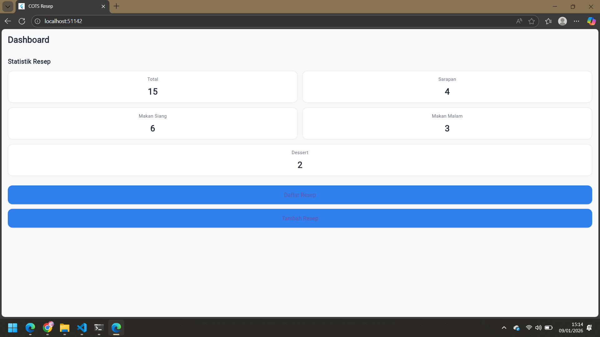
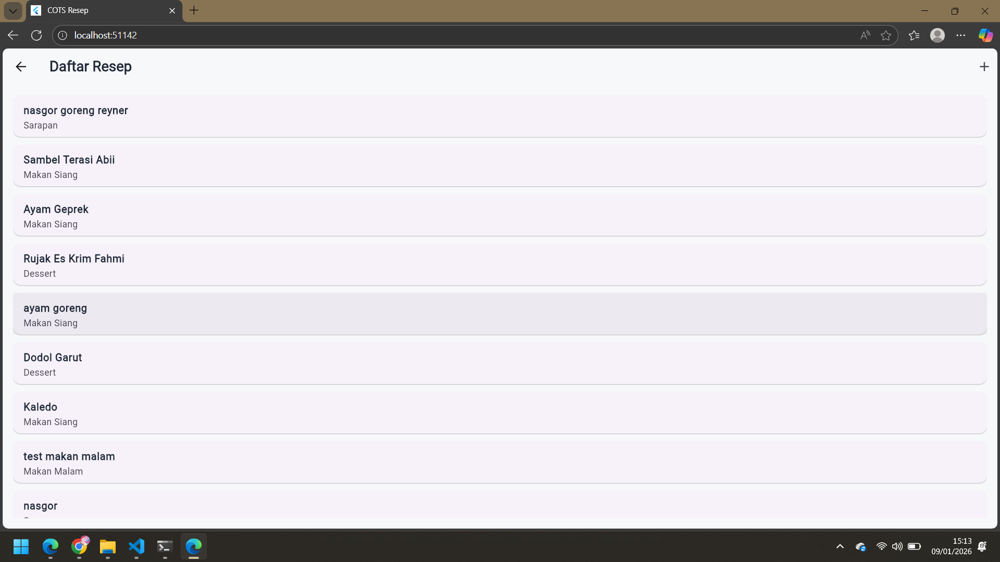
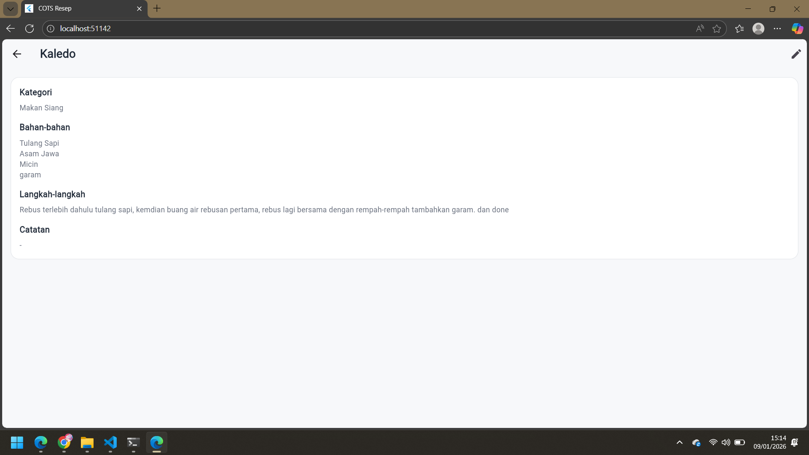
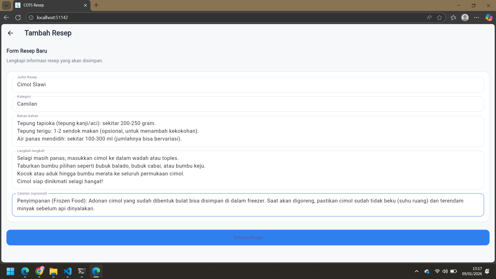

# COTS – Pemrograman Perangkat Bergerak

**Nama**  : Zhafir Zaidan Avail  
**NIM**   : 2311104059  
**Kelas** : SE-07-02  

Aplikasi ini dibuat untuk memenuhi tugas **Coding On The Spot (COTS)** mata kuliah  
**Pemrograman Perangkat Bergerak**.

---

## 📱 Deskripsi Aplikasi

Aplikasi **Resep Masakan** adalah aplikasi mobile berbasis **Flutter** yang digunakan untuk
mengelola data resep makanan.  
Aplikasi ini terhubung dengan **Supabase REST API** dan menyediakan fitur **CRUD**
(Create, Read, Update) yang lengkap.

Aplikasi juga memiliki **Dashboard Statistik** untuk menampilkan jumlah resep
berdasarkan kategori.

---

## 🚀 Fitur Utama

| Fitur | Keterangan |
|------|----------|
| Dashboard | Halaman utama dengan statistik jumlah resep |
| Statistik Resep | Total, Sarapan, Makan Siang, Makan Malam, Dessert |
| Daftar Resep | Menampilkan semua resep dari Supabase |
| Detail Resep | Menampilkan informasi lengkap |
| Tambah Resep | Menyimpan resep baru ke Supabase (POST) |
| Edit Resep | Mengubah resep menggunakan PATCH API |
| Validasi Form | Mencegah input kosong |
| Auto Refresh | Data otomatis diperbarui setelah tambah/edit |
| UI Konsisten | Menggunakan design system (colors, spacing, typography) |

---

## 🧩 Teknologi

- Flutter
- Dart
- Supabase REST API
- Local State Management (`setState`)
- Material Design

---

## 📂 Struktur Folder

lib/
├── design_system/
│   ├── colors.dart
│   ├── typography.dart
│   └── spacing.dart
│
├── models/
│   └── recipe_model.dart
│
├── services/
│   └── recipe_service.dart
│
├── presentation/
│   ├── pages/
│   │   ├── dashboard_page.dart
│   │   ├── recipe_list_page.dart
│   │   ├── recipe_detail_page.dart
│   │   ├── add_recipe_page.dart
│   │   └── edit_recipe_page.dart
│   │
│   └── widgets/
│       ├── recipe_card.dart
│       └── primary_button.dart
│
├── config/
│   └── api_config.dart
│
└── main.dart

---

## 🖼️ Screenshot Aplikasi

